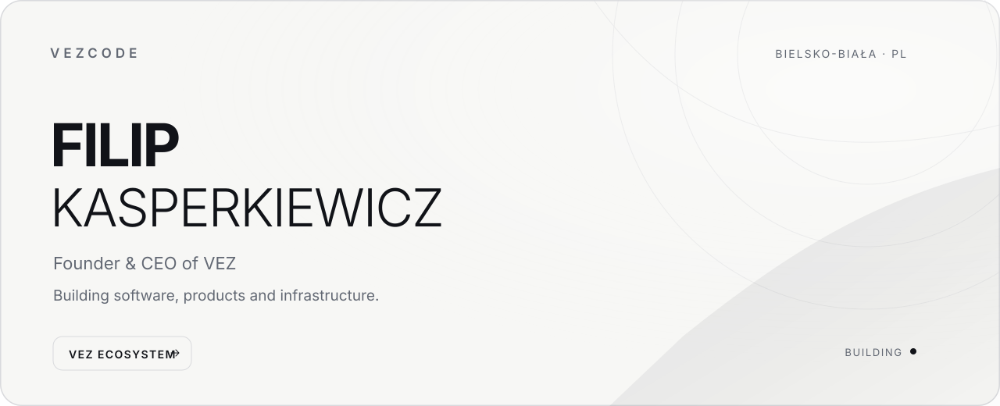
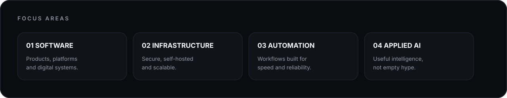

<picture>
  <source media="(prefers-color-scheme: dark)" srcset="hero-dark.svg">
  <source media="(prefers-color-scheme: light)" srcset="hero-light.svg">
  
</picture>

 

  Building software products, infrastructure and digital systems across the <strong>VEZ ecosystem</strong>.

  <a href="https://vezhq.com"><strong>VEZ</strong></a>
  &nbsp;&nbsp;·&nbsp;&nbsp;
  <a href="https://vezvision.com"><strong>VEZvision</strong></a>
  &nbsp;&nbsp;·&nbsp;&nbsp;
  <a href="https://vezlabs.dev"><strong>VEZlabs</strong></a>
  &nbsp;&nbsp;·&nbsp;&nbsp;
  <a href="https://x.com/vezcode"><strong>X / @vezcode</strong></a>

 

### Currently building

<table>
  <tr>
    <td width="33%">
      <strong>VEZ</strong>  
      Technology ecosystem connecting products, tools, infrastructure and services.
    </td>
    <td width="33%">
      <strong>VEZvision</strong>  
      Software and digital solutions designed around real business needs.
    </td>
    <td width="33%">
      <strong>VEZlabs</strong>  
      A testing ground for infrastructure, experiments and emerging technology.
    </td>
  </tr>
</table>

 

<picture>
  <source media="(prefers-color-scheme: dark)" srcset="focus-dark.svg">
  
</picture>

 

  Filip Kasperkiewicz · @vezcode · Bielsko-Biała, Poland

